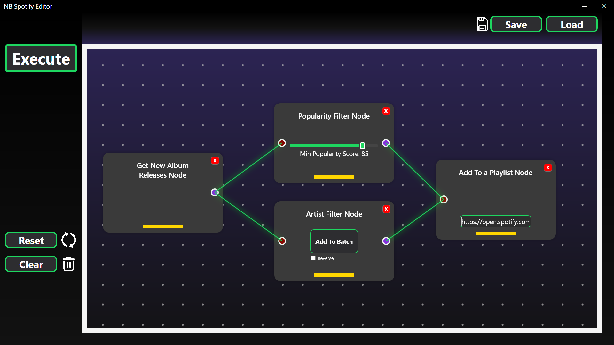
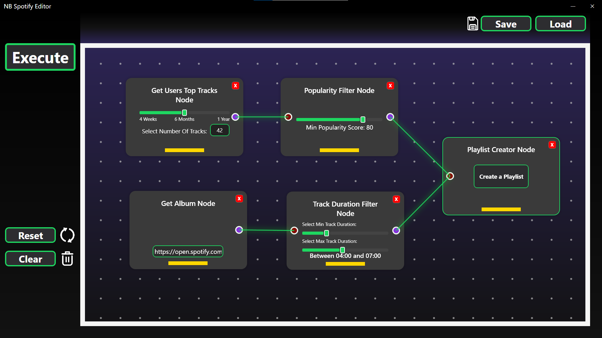
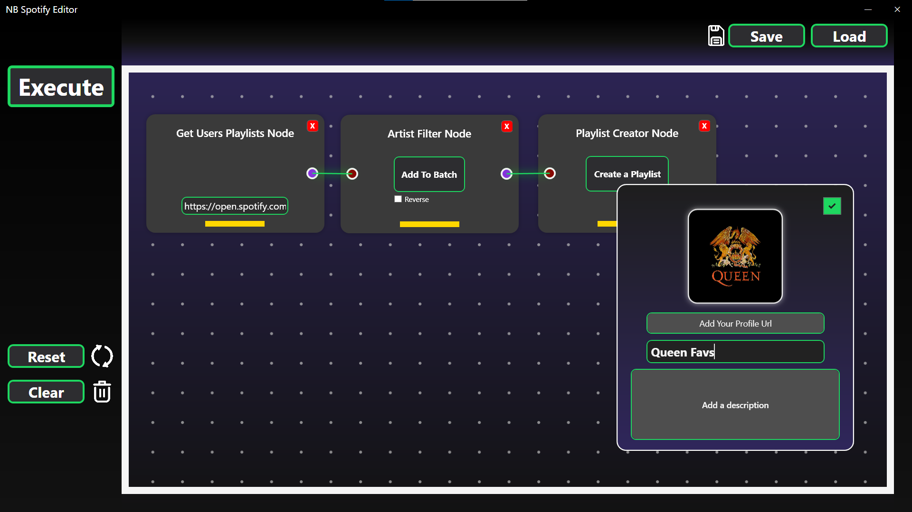

# 🎵 Node Based Spotify Editor 
**Version:** 0.1.0

A lightweight tool that helps you **edit and organize your Spotify experience** with ease.  
You can add, remove, and reorder tracks without constantly switching between Spotify’s UI. 


---

## 🚀 Features
- 🔍 Search and add tracks to your playlists  
- ➖ Remove unwanted songs instantly    
- 🎨 Minimal and user-friendly interface  
- 🔑 Spotify API integration  

---
## 📸 Screenshots


*Get new albums and filter them up to your taste and add to your existing playlist.*






*Filter your mixed playlists and generate new playlists  (this is why i made this project 😬)*


## 🎧 Music I Listened to While Building This Project

Here’s the playlist that kept me motivated during the development of **Spotify Playlist Editor**:

[](https://open.spotify.com/playlist/2ID29H3KFyrJh5cAGSPW3S)


## 🛠 Built With
- [C#](https://learn.microsoft.com/en-us/dotnet/csharp/)  
- [WPF (Windows Presentation Foundation)](https://learn.microsoft.com/en-us/dotnet/desktop/wpf/)  
- [Spotify Web API](https://developer.spotify.com/documentation/web-api/)


## 🤝 Contributing
Contributions are welcome! Please fork the repository and create a pull request.


  
## 🛠️ Installation

```bash
# Clone this repository
git clone https://github.com/your-username/SpotifyEditor.git

# Navigate into the project folder
cd SpotifyEditor

# Open the solution in Visual Studio and run the project
